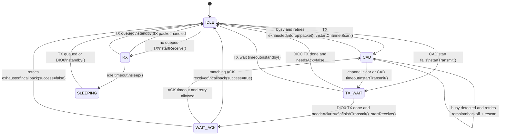
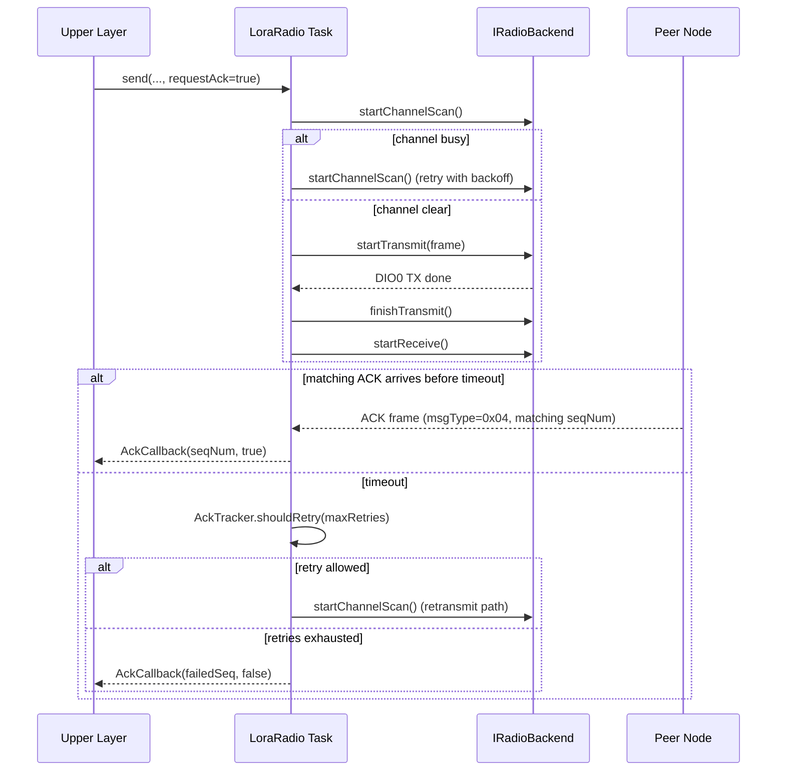

# Link Layer Architecture

## 1. Introduction and Scope

This repository implements the **LoRa Link Layer** for an ESP-IDF-based V2V communication stack. The implementation is centered on the `lora_radio` component (`components/lora_radio`) and exposes a single orchestration class, `LoraRadio`, defined in `components/lora_radio/include/lora_radio.hpp`.

Within the three-layer system context, this codebase is responsible for:

- Constructing and parsing link-layer frames (`PacketHeader`) (`components/lora_radio/include/lora_packet.hpp`)
- Medium access coordination using Channel Activity Detection (CAD) before transmission (`components/lora_radio/src/lora_state_handlers.cpp`)
- Optional per-frame ACK/retransmission logic (`components/lora_radio/src/ack_tracker.cpp`, `components/lora_radio/src/lora_state_handlers.cpp`)
- Continuous receive handling and callback delivery (`components/lora_radio/src/lora_state_handlers.cpp`)
- Neighbor signal-quality tracking (`components/lora_radio/src/neighbor_table.cpp`)
- Radio power-state transitions (active receive vs modem sleep) (`components/lora_radio/src/lora_state_handlers.cpp`)

Scope boundary:

- **Above this layer:** callers interact through `LoraRadio::send(...)`, `setRxCallback(...)`, and `setAckCallback(...)` (`components/lora_radio/include/lora_radio.hpp`).
- **Below this layer:** physical radio operations are delegated through `IRadioBackend` and implemented concretely for SX1278/RadioLib (`components/lora_radio/include/radio_backend.hpp`, `components/lora_radio/include/sx1278_backend.hpp`).

No routing or multi-hop forwarding logic is implemented in this repository; those functions are intentionally outside Link Layer scope.

## 2. Repository and Component Structure

The repository is structured as an ESP-IDF project (`CMakeLists.txt` at root), with the Link Layer implementation contained in one reusable component:

- **Core component:** `components/lora_radio`
  - Public interfaces in `components/lora_radio/include/*.hpp`
  - Runtime implementation in `components/lora_radio/src/*.cpp`
  - Build registration in `components/lora_radio/CMakeLists.txt`
- **Tests:** `test/main`
  - Unit and state-machine tests linked against `lora_radio` (`test/main/CMakeLists.txt`)
  - Mock hardware backend in `test/main/mock/mock_radio_backend.hpp`
- **Documentation sources:** `docs/mainpage.md`, `components/lora_radio/README.rst`

The `lora_radio` component registers the following source modules (`components/lora_radio/CMakeLists.txt`):

- `lora_radio.cpp`: lifecycle, send API, queue/task setup, ISR trampolines
- `lora_state_handlers.cpp`: state machine behavior and RX/TX/ACK runtime logic
- `ack_tracker.cpp`: ACK tracking/retry helper logic
- `neighbor_table.cpp`: per-node RSSI/SNR table logic
- `esp_hal_s3.cpp`: RadioLib HAL implementation on ESP-IDF SPI/GPIO/timing

This decomposition separates orchestration (`LoraRadio`), protocol helpers (`AckTracker`, packet helpers), and hardware adaptation (`IRadioBackend`, `EspHal`), while preserving a single component-level API surface.

## 3. External Interfaces and Integration Boundaries

`LoraRadio` is the sole public integration point for upper layers (`components/lora_radio/include/lora_radio.hpp`). The upper layer interaction model is callback-driven and asynchronous.

Representative public interface signatures:

```cpp
esp_err_t send(uint16_t dstId, uint8_t msgType, const uint8_t* data, size_t len, bool requestAck = false);
void setRxCallback(RxCallback cb);
void setAckCallback(AckCallback cb);
size_t getNeighbors(NeighborEntry* out, size_t maxCount) const;
```

Integration boundaries are explicit:

- **Upstream boundary:** payload submission via `send(...)`; inbound delivery via `RxCallback`; reliability outcome delivery via `AckCallback`.
- **Downstream boundary:** all modem operations pass through `IRadioBackend` (`begin`, `startChannelScan`, `startTransmit`, `startReceive`, `readData`, `sleep`, `standby`) in `components/lora_radio/include/radio_backend.hpp`.
- **Concrete production backend:** `Sx1278Backend` forwards `IRadioBackend` calls to RadioLib `SX1278` (`components/lora_radio/include/sx1278_backend.hpp`).
- **Concrete test backend:** `MockRadioBackend` implements the same contract for deterministic tests (`test/main/mock/mock_radio_backend.hpp`).

```mermaid
flowchart LR
    U[Upper Layer Caller\nNetwork/Application]
    LRAD[LoraRadio\ncomponents/lora_radio/include/lora_radio.hpp]
    IFACE[IRadioBackend\nradio_backend.hpp]
    SXB[Sx1278Backend\nsx1278_backend.hpp]
    HAL[EspHal\nesp_hal_s3.hpp/.cpp]
    RL[RadioLib Module + SX1278]
    HW[SX1278 Radio Hardware]

    U -->|send()/callbacks| LRAD
    LRAD --> IFACE
    IFACE --> SXB
    SXB --> RL
    RL --> HAL
    RL --> HW
```

## 4. Configuration Model

Configuration is defined through ESP-IDF Kconfig symbols (`components/lora_radio/Kconfig`) and mirrored in the runtime struct `LoraRadioConfig` (`components/lora_radio/include/lora_config.hpp`). The default constructor `LoraRadioConfig{}` maps directly to Kconfig defaults, enabling board-specific tuning without source changes.

Configuration categories implemented in code:

- **Hardware pin/bus mapping:** SPI host and LoRa control pins (`CONFIG_LORA_SPI_HOST`, `CONFIG_LORA_PIN_*`)
- **RF modem parameters:** frequency, bandwidth, spreading factor, coding rate, TX power, sync word (`CONFIG_LORA_FREQUENCY_HZ`, `CONFIG_LORA_BANDWIDTH_HZ`, etc.)
- **Node identity:** `CONFIG_LORA_NODE_ID`
- **Tasking/queue behavior:** stack size, priority, queue depth (`CONFIG_LORA_TASK_*`, `CONFIG_LORA_TX_QUEUE_DEPTH`)
- **Reliability/power behavior:** retry limits, ACK timeout, CAD retries, sleep timeout (`CONFIG_LORA_MAX_RETRIES`, `CONFIG_LORA_ACK_TIMEOUT_MS`, `CONFIG_LORA_CAD_RETRIES`, `CONFIG_LORA_SLEEP_IDLE_MS`)
- **Test controls:** `CONFIG_LORA_ENABLE_TEST_SEAM`, `CONFIG_LORA_HW_TEST_ENABLED`

This two-layer model (Kconfig + runtime struct) is used by initialization logic (`LoraRadio::init()` and `_initCommon(...)` in `components/lora_radio/src/lora_radio.cpp`) and by runtime state handlers (`components/lora_radio/src/lora_state_handlers.cpp`) for timeout/retry decisions.

## 5. Packet Model and Frame Semantics

The link-layer wire format is defined in `components/lora_radio/include/lora_packet.hpp` and validated by `test/main/test_packet_building.cpp`.

Core constants:

- `PACKET_HEADER_SIZE == 8`
- `LORA_MAX_PAYLOAD == 247`
- `MAX_FRAME_SIZE == 255` (8-byte header + 247-byte payload)
- `MSGTYPE_ACK == 0x04` (reserved for internal link-layer ACK)

Packet header definition:

```cpp
#pragma pack(push, 1)
struct PacketHeader {
    uint16_t srcId;
    uint16_t dstId;      // 0xFFFF = broadcast
    uint8_t  seqNum;
    uint8_t  msgType;    // 0x04 reserved for ACK
    uint8_t  flags;      // FLAG_ACK_REQUEST, FLAG_IS_RETRANSMIT
    uint8_t  payloadLen;
};
#pragma pack(pop)
```

Frame semantics implemented:

- **Addressing:** `srcId` and `dstId` are 16-bit node identifiers; `0xFFFF` is broadcast.
- **Reliability metadata:** `seqNum` and `flags` support ACK matching and retransmission marking.
- **Application type multiplexing:** `msgType` is caller-defined except `0x04`, which is reserved.
- **Payload size enforcement:** `send(...)` rejects payloads exceeding `LORA_MAX_PAYLOAD` (`components/lora_radio/src/lora_radio.cpp`).

The test suite explicitly checks layout stability (size and field offsets), flag independence, and header serialization/deserialization behavior (`test/main/test_packet_building.cpp`), which is critical for over-the-air interoperability.

## 6. Runtime Concurrency and Execution Model

The runtime model is a **single-owner radio task** plus **multi-producer enqueue API**:

- Any task may call `LoraRadio::send(...)` (producer side).
- Exactly one FreeRTOS task (`taskLoop`) performs all backend/radio operations (consumer side).
- DIO interrupts only signal the task using notification bits (`NOTIFY_DIO0`, `NOTIFY_DIO1`) (`components/lora_radio/src/lora_radio.cpp`).

Concurrency primitives:

- Static queue: `xQueueCreateStatic(...)` with `s_normalQueueStorage`
- Static task: `xTaskCreateStatic(...)` with `s_taskStack` and `s_taskTcb`
- Task notifications: `xTaskNotify*` and `xTaskNotifyWait(...)`

This architecture avoids dynamic allocation for queue/task infrastructure after initialization and keeps ISR handlers minimal:

- `dio0Isr()` / `dio1Isr()` do not access SPI or parse packets.
- ISR context only posts notification bits and yields as needed.

The state machine loop (`taskLoop`) executes a handler table dispatch:

```cpp
if (!(this->*s_handlers[stateIndex])()) {
    return;
}
```

As a result, timing-sensitive radio sequencing (CAD, TX completion, ACK wait, RX reads, sleep/wake) remains serialized in one task context, reducing race complexity across protocol paths.

## 7. State Machine Architecture

State behavior is implemented in `components/lora_radio/src/lora_state_handlers.cpp` and dispatched via the static handler table `LoraRadio::s_handlers`.

Defined states (`components/lora_radio/include/lora_radio.hpp`):

- `IDLE`
- `CAD`
- `TX_WAIT`
- `WAIT_ACK`
- `RX`
- `SLEEPING`

Key transition triggers:

- TX queue availability (`dequeueNextTx(...)`)
- DIO notifications (`NOTIFY_DIO0`, `NOTIFY_DIO1`)
- Timeout expiry (CAD timeout, TX timeout, ACK timeout, RX idle timeout)
- Control notifications (`NOTIFY_TX_QUEUED`, `NOTIFY_STOP`)



## 8. Transmission and MAC Workflow

Transmission starts from `LoraRadio::send(...)` (`components/lora_radio/src/lora_radio.cpp`):

1. Validate payload length (`<= LORA_MAX_PAYLOAD`)
2. Build `PacketHeader` (`srcId`, `dstId`, `seqNum`, `msgType`, `flags`, `payloadLen`)
3. Copy payload into `LoraTxItem`
4. Enqueue into `_normalQueue` (`xQueueSend`)
5. If currently in `RX` or `SLEEPING`, notify task with `NOTIFY_TX_QUEUED`

MAC access control is implemented in `handleIdle()` and `handleCad()` (`components/lora_radio/src/lora_state_handlers.cpp`):

- On dequeued packet, perform `startChannelScan()`.
- If CAD indicates busy (`NOTIFY_DIO1` or `RADIO_LORA_DETECTED`), retry up to `cadRetries`.
- Between retries, apply random backoff (`50 + rand()%150` ms).
- If retries are exhausted, drop packet and return to `IDLE`.
- If CAD is clear (or CAD timeout), transition to `TX_WAIT` and start transmission.

Transmit completion is managed in `handleTxWait()`:

- On `NOTIFY_DIO0`, call `finishTransmit()`.
- If ACK is not required, clear pending TX and return to `IDLE`.
- If ACK is required, start ACK tracking and transition to `WAIT_ACK`.
- On TX timeout, call `standby()`, clear pending TX, and return to `IDLE`.

## 9. ACK Reliability Workflow

ACK reliability is optional per transmitted frame and is activated by `requestAck=true` in `send(...)` (`components/lora_radio/src/lora_radio.cpp`).

Tracking logic is encapsulated in `AckTracker` (`components/lora_radio/include/ack_tracker.hpp`, `components/lora_radio/src/ack_tracker.cpp`):

- `startTracking(...)` snapshots the transmitted `LoraTxItem`
- `matchesAck(...)` validates ACK frame identity:
  - `msgType == MSGTYPE_ACK`
  - `seqNum` equals tracked TX sequence
  - ACK destination equals local node ID
- `shouldRetry(maxRetries)` increments retry counter and sets `FLAG_IS_RETRANSMIT`

`WAIT_ACK` behavior (`components/lora_radio/src/lora_state_handlers.cpp`):

- On DIO0 receive event:
  - Parse inbound frame
  - If ACK matches tracked packet, clear tracker and fire `AckCallback(seq, true)`
  - If not an ACK match, process as normal inbound traffic (`dispatchRx(...)`)
- On ACK timeout:
  - If retry budget remains, stage retransmit and return to `CAD`
  - Otherwise, drop pending TX and fire `AckCallback(failedSeq, false)`



## 10. Receive Pipeline and Inbound Filtering

Receive processing is split between `handleRx()` and `dispatchRx(...)` in `components/lora_radio/src/lora_state_handlers.cpp`.

Pipeline stages:

1. Wait in RX state for DIO0 event (or sleep timeout / TX-queued wake path).
2. Read packet length and payload from backend.
3. Fetch RSSI/SNR.
4. Call `dispatchRx(...)` for protocol-level filtering and callback handling.

`dispatchRx(...)` policy order:

- Reject short frames (`len < PACKET_HEADER_SIZE`)
- Parse `PacketHeader`
- Update neighbor table immediately using source ID and signal metrics
- Drop packets not addressed to local node and not broadcast
- Suppress application callback for pure ACK frames (`msgType == MSGTYPE_ACK`)
- If `FLAG_ACK_REQUEST` is present, generate and enqueue ACK frame using `buildAckFrame(...)`
- Deliver payload to application callback if `RxCallback` is registered

```mermaid
flowchart TD
    A[DIO0 in RX state] --> B[getPacketLength + readData + getRSSI/getSNR]
    B --> C{len >= PACKET_HEADER_SIZE?}
    C -- No --> Z[Drop]
    C -- Yes --> D[Parse PacketHeader]
    D --> E[Update NeighborTable]
    E --> F{dstId is local or 0xFFFF?}
    F -- No --> Z
    F -- Yes --> G{msgType == MSGTYPE_ACK?}
    G -- Yes --> Z
    G -- No --> H{FLAG_ACK_REQUEST set?}
    H -- Yes --> I[buildAckFrame + enqueue ACK]
    H -- No --> J
    I --> J{RxCallback set?}
    J -- Yes --> K[Invoke RxCallback(header,payload,rssi,snr)]
    J -- No --> Z
    K --> Z
```

## 11. Neighbor Tracking Subsystem

Neighbor tracking is implemented by `NeighborTable` (`components/lora_radio/include/neighbor_table.hpp`, `components/lora_radio/src/neighbor_table.cpp`) and exposed via `LoraRadio::getNeighbors(...)` (`components/lora_radio/src/lora_radio.cpp`).

Stored data per entry (`NeighborEntry`):

- `nodeId`
- `rssi`
- `snr`
- `lastSeenMs`
- `valid`

Update semantics (`NeighborTable::update(...)`):

1. Compute current time from `esp_timer_get_time()`.
2. If node already exists, update RSSI/SNR/timestamp in place.
3. Else use first invalid slot if available.
4. If table is full, replace the oldest entry (`minimum lastSeenMs`).

Call sites:

- For all non-short inbound frames in `dispatchRx(...)` (`components/lora_radio/src/lora_state_handlers.cpp`)
- For matched ACK frames in `handleWaitAck()` (`components/lora_radio/src/lora_state_handlers.cpp`)
- Via test seam method `injectNeighborUpdate(...)` (`components/lora_radio/src/lora_radio.cpp`)

```mermaid
flowchart TD
    A[NeighborTable.update(nodeId,rssi,snr)] --> B[Scan entries]
    B --> C{matching valid nodeId found?}
    C -- Yes --> D[Update RSSI/SNR/lastSeenMs]
    C -- No --> E{free invalid slot found?}
    E -- Yes --> F[Insert new entry]
    E -- No --> G[Find oldest lastSeenMs]
    G --> H[Replace oldest entry]
    D --> I[Done]
    F --> I
    H --> I
```

## 12. Power Management Behavior

Power management is integrated into the runtime state machine via `RX` and `SLEEPING` states (`components/lora_radio/src/lora_state_handlers.cpp`).

Implemented behavior:

- In `RX`, `waitNotify(_cfg.sleepIdleMs)` blocks for either events or idle timeout.
- If no RX or TX-queued event occurs before timeout, `sleep()` is called and state moves to `SLEEPING`.
- In `SLEEPING`, the task blocks indefinitely (`portMAX_DELAY`) until wake trigger.
- Wake triggers are `NOTIFY_TX_QUEUED` (new outbound packet) or `NOTIFY_DIO0`; wake path calls `standby()` and returns to `IDLE`.

Control parameter:

- `_cfg.sleepIdleMs` from `CONFIG_LORA_SLEEP_IDLE_MS` (`components/lora_radio/include/lora_config.hpp`, `components/lora_radio/Kconfig`)

Observed verification:

- `test_sleep_entered_after_idle_timeout` and `test_wake_from_sleep_on_tx_enqueue` validate sleep entry and wake-on-send behavior (`test/main/test_state_machine.cpp`).

## 13. Hardware Abstraction and Platform Layer

Hardware access is intentionally layered:

1. `LoraRadio` (protocol/state logic)
2. `IRadioBackend` (hardware operation contract)
3. `Sx1278Backend` (RadioLib SX1278 adapter)
4. `EspHal` (RadioLib HAL implemented with ESP-IDF drivers)

`IRadioBackend` (`components/lora_radio/include/radio_backend.hpp`) defines all operations needed by the state machine, including:

- modem setup (`begin`)
- CAD start/result
- async TX start/finalize
- continuous RX and packet reads
- RSSI/SNR retrieval
- sleep/standby transitions
- DIO0/DIO1 interrupt binding

`Sx1278Backend` (`components/lora_radio/include/sx1278_backend.hpp`) is a thin forwarding adapter, keeping RadioLib symbols out of the protocol state-machine translation units.

`EspHal` (`components/lora_radio/include/esp_hal_s3.hpp`, `components/lora_radio/src/esp_hal_s3.cpp`) provides platform services to RadioLib:

- SPI bus/device setup via `spi_bus_initialize` and `spi_bus_add_device`
- GPIO read/write and mode setup
- Interrupt attach/detach via ESP-IDF GPIO ISR service
- timing primitives (`millis`, `micros`, delays)

In production initialization (`components/lora_radio/src/lora_radio.cpp`), object creation follows:

- `EspHal` → `Module` → `SX1278` → `Sx1278Backend`

In test mode (`initForTest(...)`), this hardware stack is skipped and an injected backend is used instead.

## 14. Initialization and Shutdown Lifecycle

Lifecycle control is implemented in `components/lora_radio/src/lora_radio.cpp`.

Initialization paths:

- **Production path:** `init()`
  - creates `EspHal`, `Module`, `SX1278`, and `Sx1278Backend`
  - calls `_initCommon(...)` for shared bring-up
- **Test path:** `initForTest(IRadioBackend*)` (only with `CONFIG_LORA_ENABLE_TEST_SEAM`)
  - skips hardware object creation
  - uses injected backend
  - marks backend as externally owned (`_ownsBackend = false`)

Shared bring-up (`_initCommon(...)`):

- Executes modem begin/configuration through backend `begin(...)`
- On failure, releases created resources and returns `ESP_FAIL`
- Binds DIO actions to ISR trampolines
- Creates static TX queue and static state-machine task
- Marks instance initialized

Shutdown (`deinit()`):

- Sends `NOTIFY_STOP` to task and waits briefly
- Clears DIO actions and puts backend to sleep
- Deletes owned backend if applicable
- Deletes raw hardware objects (`SX1278`, `Module`, `EspHal`) if present
- Clears ACK tracker and initialized flag

```mermaid
flowchart TD
    A[init()] --> B[Create EspHal]
    B --> C[Create Module]
    C --> D[Create SX1278]
    D --> E[Create Sx1278Backend]
    E --> F[_initCommon(backend)]

    A2[initForTest(external backend)] --> F

    F --> G[backend.begin(...)]
    G -->|fail| H[cleanup created resources + return ESP_FAIL]
    G -->|ok| I[set DIO actions]
    I --> J[create static queue]
    J --> K[create static task]
    K --> L[_initialized = true]

    M[deinit()] --> N[notify task stop]
    N --> O[clear DIO actions + backend.sleep()]
    O --> P[delete owned backend]
    P --> Q[delete SX1278/Module/EspHal if present]
    Q --> R[clear tracker + mark uninitialized]
```

## 15. Testability and Verification Architecture

The component includes a layered verification strategy under `test/main`, driven by Unity in `test/main/test_runner.cpp`.

Testability enablers:

- **Backend abstraction seam:** `IRadioBackend` allows deterministic mocking of radio behavior.
- **Mock implementation:** `MockRadioBackend` (`test/main/mock/mock_radio_backend.hpp`) provides:
  - programmable return codes
  - synthetic RX buffers and RSSI/SNR values
  - call counters for backend methods
  - simulated DIO0/DIO1 interrupt triggers via `fireDio0()` and `fireDio1()`
- **Optional internal seam methods:** when `CONFIG_LORA_ENABLE_TEST_SEAM` is enabled:
  - `initForTest(IRadioBackend*)`
  - `injectNeighborUpdate(...)`
  - `getState()`
  (declared in `components/lora_radio/include/lora_radio.hpp`)

Validation layers implemented in repository:

- **Wire-format tests:** `test_packet_building.cpp` validates struct packing, constants, and field offsets.
- **Send API contract tests:** `test_send_validation.cpp` validates payload limits, queue overflow behavior, sequence progression, and initialization failure handling.
- **Neighbor-table tests:** `test_neighbor_table.cpp` validates insert/update/cap/eviction behavior.
- **State-machine tests:** `test_state_machine.cpp` validates transitions, CAD retry/drop paths, ACK success/failure flows, auto-ACK generation, RX filtering, and sleep/wake behavior.
- **Optional hardware integration tests:** `test_hardware_integration.cpp` validates over-the-air exchange between two boards when `CONFIG_LORA_HW_TEST_ENABLED=y`.
